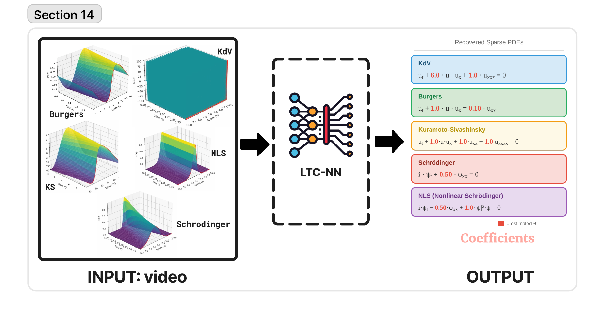

# VIPER: Video-Informed PDE Extraction and Recovery

**CVPR 2026 Workshop on Women in Computer Vision (WiCV)**


> **VIPER** recovers sparse PDE coefficients directly from RGB video of spatiotemporal dynamics — no direct field measurements required.

**Authors:** Farhat Shaikh, Ayan Banerjee, Sandeep Gupta
IMPACT Lab, School of Computing & Augmented Intelligence (SCAI), Arizona State University

---

## Overview

Existing PDE discovery methods (PDE-FIND, SINDy) assume direct access to spatiotemporal field measurements u(x,t) and rely on numerical differentiation, which amplifies noise at rate O((sigma/dx)^k) for k-th order derivatives. In practice, dynamics are often captured as **video** — from thermal cameras to simulation visualizations.

**VIPER** bridges this gap through a four-stage pipeline:

1. **Video-to-Field Extraction** — Colormap inversion recovers u(x,t) from RGB frames
2. **Method-of-Lines Discretization** — Converts PDE to coupled ODEs on a spatial grid
3. **LTC Encoder** — A Liquid Time-Constant neural network estimates coefficients, with hidden states modeling unobserved spatial modes
4. **Differentiable PDE Solver** — Validates coefficients by forward integration (ETDRK4 / split-step Fourier), converting the noise-amplifying differentiation problem into a noise-attenuating integration problem

<p align="center">
  
</p>

## Key Results

### Clean Video (Table 2)

| PDE | VIPER (%) | PDE-FIND (%) | Improvement |
|-----|-----------|-------------|-------------|
| KdV | **5.27** | 534.70 | 101x |
| Burgers | **0.67** | 1.95 | 2.9x |
| KS | **2.30** | 2.31 | 1.0x |
| Schrodinger | **6.22** | 92.95 | 14.9x |
| NLS | **28.56** | 100.00 | 3.5x |

### Noisy Video — 5% Gaussian noise (Table 3)

| PDE | VIPER (%) | PDE-FIND (%) | Improvement |
|-----|-----------|-------------|-------------|
| KdV | 87.30 | 100.00 | 1.15x |
| Burgers | **10.97** | 100.00 | 9.1x |
| KS | **3.47** | 99.95 | 28.8x |
| Schrodinger | **12.51** | 99.02 | 7.9x |
| NLS | **23.36** | 99.82 | 4.3x |

### Implicit Dynamics — Partial Spatial Observability (Table 4)

VIPER recovers coefficients from as little as **20% spatial coverage**, a regime where derivative-based methods fundamentally cannot operate.

| PDE | 20% Cov. | 40% Cov. | 60% Cov. | 80% Cov. |
|-----|----------|----------|----------|----------|
| KS | 3.19% | 1.87% | **0.52%** | 0.89% |
| Schrodinger | **0.04%** | 0.12% | 0.20% | 0.35% |
| Burgers | 19.27% | 8.43% | 2.15% | **0.63%** |

*Coefficient error (%) — lower is better. PDE-FIND fails (>90% error) across all coverage levels.*

## PDEs Evaluated

| PDE | Equation | Dynamics |
|-----|----------|----------|
| KdV | u_t + 6u·u_x + u_xxx = 0 | Dispersive solitons |
| Burgers | u_t + u·u_x = 0.1·u_xx | Viscous shocks |
| KS | u_t + u·u_x + u_xx + u_xxxx = 0 | Spatiotemporal chaos |
| Schrodinger | i·u_t + 0.5·u_xx = 0 | Linear dispersion |
| NLS | i·u_t + 0.5·u_xx + \|u\|^2·u = 0 | Nonlinear optics |

## Installation

```bash
git clone https://github.com/ImpactLabASU/VIPER-CVPR2026.git
cd VIPER-CVPR2026

# (recommended) create an isolated environment
python -m venv .venv && source .venv/bin/activate   # Windows: .venv\Scripts\activate

pip install -r requirements.txt
```

### Requirements

- Python 3.8+
- PyTorch >= 1.10
- NumPy, SciPy, Matplotlib
- [ncps](https://github.com/mlech26l/ncps) >= 0.0.4 (LTC networks)
- OpenCV (optional, for video I/O)

## Usage

### Full Pipeline

The end-to-end pipeline runs in five stages. A pre-shipped copy of the generated
data lives in `data/`; re-run steps 1-2 only if you want to regenerate it.

```bash
# Run everything (generate -> render -> experiments -> tables)
bash run_experiments.sh
```

Or run each stage manually:

```bash
# 1. Generate ground-truth PDE simulations -> data/simulations/
python experiments/generate_simulations.py --all

# 2. Render simulations to RGB video -> data/videos/
python experiments/render_videos.py --all

# 3. Run experiments (results written to results/)
python experiments/exp1_clean.py                              # clean video
python experiments/exp2_noisy.py --noise gaussian --level 0.05 # 5% Gaussian noise
python experiments/exp3_implicit.py                            # partial spatial observability

# 4. Ablation
python experiments/exp4_ablation.py --ablation hidden --pde burgers

# 5. Aggregate results into tables -> results/tables/
python experiments/generate_results.py
```

All scripts resolve paths relative to the repository root, so they can be run
from anywhere.

## Project Structure

```
VIPER-CVPR2026/
├── simp_video/                 # core package
│   ├── models/
│   │   ├── simp_v.py           # VIPER model (LTC encoder + differentiable solver)
│   │   └── baselines/          # PDE-FIND, DeepMoD, PINN-inverse, DeLFYS
│   └── utils/                  # PDE solvers, metrics, video extract/render (2D + 3D)
├── experiments/                # experiment + data-generation scripts
├── configs/
│   └── experiment_configs.yaml # PDE, video, noise, training settings
├── data/                       # generated simulations (.npz) and videos (.mp4)
├── results/                    # experiment outputs (JSON/CSV) and tables
├── figures/                    # paper figures
├── requirements.txt
└── run_experiments.sh          # full pipeline driver
```

## Training Hyperparameters

Defined in `configs/experiment_configs.yaml`.

| Hyperparameter | Value |
|----------------|-------|
| LTC units | 64 |
| Learning rate | 5e-4 |
| Max epochs | 500 |
| Early-stop patience | 100 |
| Batch size | 1 |
| Sparsity weight (lambda) | 1e-3 |
| Seeds | 42, 123, 456, 789, 1011 |

Video rendering: 256x128 resolution, 30 fps, `viridis` colormap, H.264 (`libx264`).

## Acknowledgments

This project is partially funded by DARPA AMP-N6600120C4020, DARPA FIRE-P000050426, NSF FDT-Biotech grant (2436801), NIH R21 grant (1R21HL175632).

## Citation


## License

This project is for academic research purposes. 
